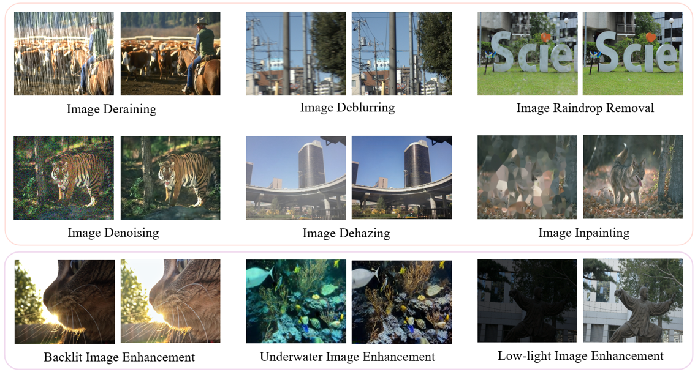

# Unified Image Restoration and Enhancement: Degradation Calibrated Cycle Reconstruction Diffusion Model  
#### This is the official implementation code for [CycleRDM]().




### Updates
[**2024.12.23**] Added [dataset links](https://github.com/hejh8/CycleRDM#dataset-links) for training and testing of various tasks. <br>
[**2024.12.23**] The **pretrained weights**  of the four task models were released separately.  <br>
[**2024.12.23**] Released test code for four image restoration tasks: image deraining, image denoising, image dehazing, and image inpainting. <br>

## How to Run the Code?


### Dependencies

* OS: Ubuntu 22.04
* nvidia:
	- cuda: 12.1
* python 3.9

### Install

 Clone Repo
 ```bash
 git clone https://github.com/He-Jinhong/CFGW.git
 cd CycleRDM  
 ```
Create Conda Environment and Install Dependencies:
```bash
pip install -r requirements.txt
```

### Dataset Preparation

Preparing the train and test datasets following our paper Dataset subsection as:

```bash
#### for training dataset ####
data
|--dehazing
   |--train
      |--LQ/*.png
      |--GT/*.png
      |--train.txt
   |--test
      |--LQ/*.png
      |--GT/*.png
      |--test.txt
|--deblurring
|--denoising
|--deraining
|--raindrop
|--inpainting
|--low-light
|--underwater
|--backlight


Then You need to get into the `CycleRDM/config` directory and modify the `Task_train.yml` and `Task_test.yml` settings therein to suit your needs. 

```
For the training datas, we selected only up to 500 images in each task. You can select more training datas as you wish through the [script](https://github.com/hejh8/CycleRDM/scripts/Random_select_data.py).
```bash

cd CycleRDM/scripts

python3 Random_select_data.py 

```

#### Dataset Links


| Image Restoration Task          |                                   deblurring                                   |                                           dehazing                                           |                                           deraining                                           |            raindrop            |                                     denoising                                     |              inpainting              |
|---------------|:-----------------------------------------------------------------------------:|:-------------------------------------------------------------------------------------------:|:--------------------------------------------------------------------------------------------:|:-------------------------------:|:---------------------------------------------------------------------------------:|:------------------------------------:|
| Datasets      | [BSD](https://drive.google.com/drive/folders/1LKLCE_RqPF5chqWgmh3pj7cg-t9KM2Hd) | [RESIDE-6k](https://drive.google.com/drive/folders/1XVD0x74vKQ0-cqazACUZnjUOWURXIeqH?usp=drive_link) | Rain100H: [train](http://www.icst.pku.edu.cn/struct/att/RainTrainH.zip), [test](http://www.icst.pku.edu.cn/struct/att/Rain100H.zip) | [RainDrop](https://drive.google.com/open?id=1e7R76s6vwUJxILOcAsthgDLPSnOrQ49K) | [CBSD68](https://github.com/clausmichele/CBSD68-dataset?tab=readme-ov-file) | [CelebaHQ-256](https://drive.google.com/file/d/1oYDBcJLT5RDuC4k5C7xOMRkZ9N3kfexu/view?usp=sharing) |


Following the settings of DA-CLIP. For noisy datasets, you can use this [script]() to generate LQ images. For image inpainting restoration tasks, you can generate LQ images by adding facial occlusion via the [script]().
```bash
cd CycleRDM/scripts

##denoising
python denoising_LQ.py

##inpainting
python mask_inpaint.py
```

| Image Enhancement Task |                                    low-light                                    |                              underwater                             |                                    backlight                                  |                                                                                         
|-------------|:-------------------------------------------------------------------------------:|:----------------------------------------------------------------------------------------------------:|:-----------------------------------------------------------------------------------------------------------------:|
| Datasets    | [LOLv1](https://drive.google.com/file/d/18bs_mAREhLipaM2qvhxs7u7ff2VSHet2/view),[LOLv2](https://drive.google.com/file/d/1dzuLCk9_gE2bFF222n3-7GVUlSVHpMYC/view) |[LSUI](https://drive.google.com/file/d/10gD4s12uJxCHcuFdX9Khkv37zzBwNFbL/view) | [Backlit300](https://drive.google.com/drive/folders/1tnZdCxmWeOXMbzXKf-V4HYI4rBRl90Qk) | 


### Training

#### Image Restoration Tasks
We will be releasing the training code shortly.


#### Pretrained Models
You can downlaod our pre-training models from [[Google Drive]](https://drive.google.com/drive/folders/1TbYBrxsTqPd8x6dqVLVoSU8JfL_3VtUu?usp=drive_link), Pre-trained models for all tasks will be published in the future.

### Evaluation
Before performing the following steps, please download our pretrained model first. To evalute our method on image restoration, please modify the benchmark path and model path. 
You need to modify ```test.py and datasets.py``` according to your environment and then

```bash
cd CycleRDM/image_ir
python ir_test.py 
```


### Results


<details>
<summary><strong>All Degradation Tasks </strong> (click to expand) </summary>


</details>

<details>
<summary><strong>Image Restoration Tasks</strong> (click to expand) </summary>


</details>

<details>
<summary><strong>Low-light Image Enhancement Tasks</strong> (click to expand) </summary>


</details>


#### Notice!!
🙁 Since degradation datasets mostly contain only a single degradation label for each image, our current model has not been trained to recover multiple degradations in the same scene. Although we have demonstrated the performance stability and generalization capabilities of CycleRDM when extended for degradation tasks, this limitation has prevented us from effectively exploring recovery capabilities for realistic mixed degradation scenes.


---

**Acknowledgment:** Our CycleRDM is based on [CFWD](https://github.com/hejh8/CFWD) and [DiffLL](https://github.com/JianghaiSCU/Diffusion-Low-Light). Thanks for their code!


### Citations
If our code helps your research or work, please consider citing our paper.
The following are BibTeX references:

```
@article{xue2024unified,
  title={Unified Image Restoration and Enhancement: Degradation Calibrated Cycle Reconstruction Diffusion Model},
  author={Xue, Minglong and He, Jinhong and Palaiahnakote, Shivakumara and Zhou, Mingliang},
  journal={arXiv preprint arXiv:2412.14630},
  year={2024}
}
```

---

#### Contact
If you have any question, please contact us.

#### --- Thanks for your interest! --- ####


